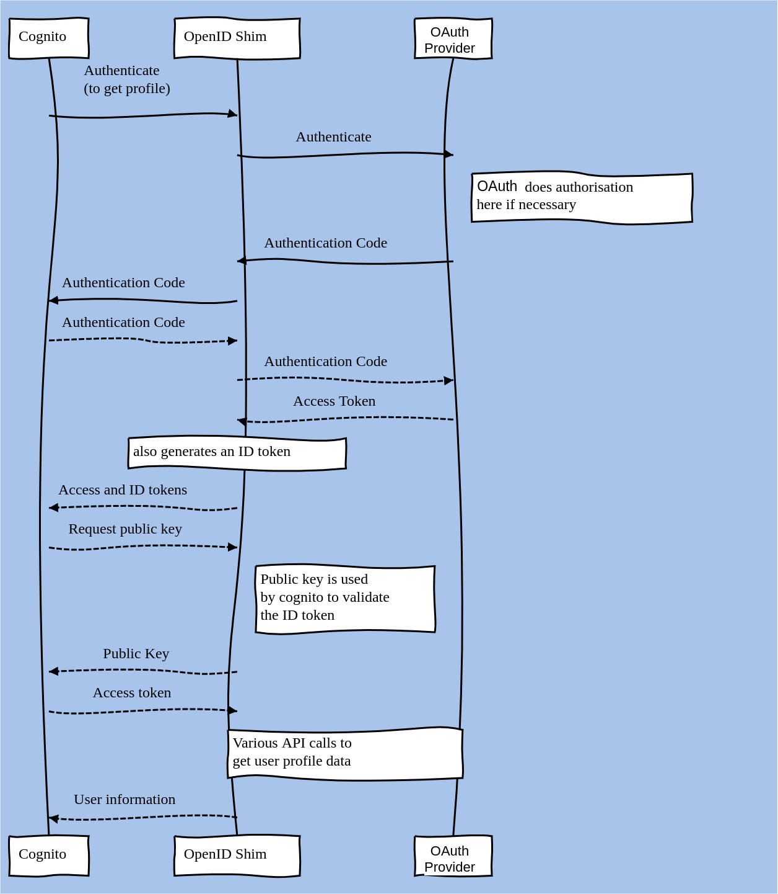

# OpenID Connect Wrapper for Cognito (Golang)

> This project is inspired from [github-cognito-openid-wrapper](https://github.com/TimothyJones/github-cognito-openid-wrapper)

Do you want to add Slack, Github, Quickbook, Clever etc as an OIDC (OpenID Connect) provider to an AWS Cognito User Pool?
Have you run in to trouble because these providers only provides OAuth2.0 endpoints, and doesn't support OpenID Connect?

This project allows right now only wrap Clever OAuth App in an OpenID Connect layer, allowing you to use it with AWS Cognito.

Here are some questions you may immediately have:

- **Why does Cognito not support federation with OAuth?** Because OAuth provides
  no standard way of requesting user identity data. (see the [background](#background)
  section below for more details).

- **Why has no one written a shim to wrap general OAuth implementations with an
  OpenID Connect layer?** Because OAuth provides no standard way of requesting
  user identity data, any shim must be custom written for the particular OAuth
  implementation that's wrapped.

## Project overview

When deployed, this project sits between Cognito and OAuth Provider:

This allows you to use OAuth Provider as an OpenID Identity Provider (IdP) for federation with a Cognito User Pool.

The project implements everything needed by the [OIDC User Pool IdP authentication flow](https://docs.aws.amazon.com/cognito/latest/developerguide/cognito-user-pools-oidc-flow.html) used by Cognito.

It implements the following endpoints from the
[OpenID Connect Core Spec](https://openid.net/specs/openid-connect-core-1_0.html):

- Authorization - used to start the authorization process ([spec](https://openid.net/specs/openid-connect-core-1_0.html#AuthorizationEndpoint))
- Token - used to exchange an authorization code for an access and ID token ([spec](https://openid.net/specs/openid-connect-core-1_0.html#TokenEndpoint))
- UserInfo - used to exchange an access token for information about the user ([spec](https://openid.net/specs/openid-connect-core-1_0.html#UserInfo))
- jwks - used to describe the keys used to sign ID tokens ([implied by spec](https://openid.net/specs/openid-connect-discovery-1_0.html#ProviderMetadata))

It also implements the following [OpenID Connect Discovery](https://openid.net/specs/openid-connect-discovery-1_0.html) endpoint:

- Configuration - used to discover configuration of this OpenID implementation's
  endpoints and capabilities. ([spec](https://openid.net/specs/openid-connect-discovery-1_0.html#ProviderConfig))

## The details

### Background

There are two important concepts for identity federation:

- Authentication: Is this user who they say they are?
- Authorization: Is the user allowed to use a particular resource?

#### OAuth

[OAuth2.0](https://tools.ietf.org/html/rfc6749) is an _authorization_ framework,
used for determining whether a user is allowed to access a resource (like
private user profile data). In order to do this, it's usually necessary for
_authentication_ of the user to happen before authorization.

This means that most OAuth2.0 implementations [include authentication in a step of the authorization process](https://medium.com/@darutk/new-architecture-of-oauth-2-0-and-openid-connect-implementation-18f408f9338d).
For all practical purposes, most OAuth2.0 implementations can
be thought of as providing both authorization and authentication.

Below is a diagram of the authentication code flow for OAuth:

(The solid lines are http requests from the browser, and then dashed lines are
back-channel requests).

As you can see in the diagram, a drawback of OAuth is that it provides no
standard way of finding out user data such as name, avatar picture, email
address(es), etc. This is one of the problems that is solved by OpenID.

#### OpenID Connect

To provide a standard way of learning about users,
[OpenID Connect](https://openid.net/connect/) is an identity layer built on top
of OAuth2.0. It extends the `token` endpoint from OAuth to include an ID Token
alongside the access token, and provides a `userinfo` endpoint, where information
describing the authenticated user can be accessed.

OpenID Connect describes a standard way to get user data, and is therefore a good choice
for identity federation.

### Custom Shim

This project provides the OpenID shim to wrap OAuth Provider's implementation, by combining the two diagrams:

#### Missing features

This is a near-complete implementation of [OpenID Connect Core](https://openid.net/specs/openid-connect-core-1_0.html).
However, since the focus was on enabling Cognito's [authentication flow](https://docs.aws.amazon.com/cognito/latest/developerguide/cognito-user-pools-oidc-flow.html),
you may run in to some missing features if you wish to use it with a different
client.

**Missing Connect Core Features:**

- Private key rotation ([spec](https://openid.net/specs/openid-connect-core-1_0.html#RotateSigKeys))
- Refresh tokens ([spec](https://openid.net/specs/openid-connect-core-1_0.html#RefreshTokens))
- Passing request parameters as JWTs ([spec](https://openid.net/specs/openid-connect-core-1_0.html#JWTRequests))

If you don't know what these things are, you are probably ok to use this project.

**Missing non-core features:**

A full OpenID implementation would also include:

- [The Dynamic client registration spec](https://openid.net/specs/openid-connect-registration-1_0.html)
- The [OpenID Connect Discovery](https://openid.net/specs/openid-connect-discovery-1_0.html) endpoints beyond `openid-configuration`

**Known issues**

See [the issue tracker](https://github.com/Durgaprasad-Budhwani/cognito-openid-connectors/issues) for an up to date list.

## Scope

Right now this wrapper only support Clever OAuth Provider but this project is going to extend to supports following OAuth Providers

- [X] Clever
- [ ] Github
- [ ] Slack
- [ ] Gitlab
- [ ] Jira
- [ ] Bitbucket

## Contributing

Contributions are welcome, especially for the missing features! Pull requests and issues are very welcome.

## License

[MIT License](LICENSE)

## Contributors ✨

Thanks goes to these wonderful people ([emoji key](https://allcontributors.org/docs/en/emoji-key)):
<!-- ALL-CONTRIBUTORS-LIST:START - Do not remove or modify this section -->
<!-- prettier-ignore-start -->
<!-- markdownlint-disable -->
<table>
  <tr>
    <td align="center"><a href="https://github.com/Durgaprasad-Budhwani"> <b>Durgaprasad Budhwani</b></a> <a href="https://github.com/Durgaprasad-Budhwani/cognito-openid-connectors/commits?author=Durgaprasad-Budhwani" title="Code">💻</a> <a href="https://github.com/Durgaprasad-Budhwani/cognito-openid-connectors/commits?author=Durgaprasad-Budhwani" title="Documentation">📖</a> <a href="#maintenance-Durgaprasad-Budhwani" title="Maintenance">🚧</a> <a href="#question-Durgaprasad-Budhwani" title="Answering Questions">💬</a> <a href="#infra-Durgaprasad-Budhwani" title="Infrastructure (Hosting, Build-Tools, etc)">🚇</a></td>
  </tr>
</table>

<!-- markdownlint-restore -->
<!-- prettier-ignore-end -->
<!-- ALL-CONTRIBUTORS-LIST:END -->

<!-- ALL-CONTRIBUTORS-LIST:START - Do not remove or modify this section -->
<!-- prettier-ignore-start -->
<!-- markdownlint-disable -->
<!-- markdownlint-restore -->
<!-- prettier-ignore-end -->
<!-- ALL-CONTRIBUTORS-LIST:END -->

This project follows the [all-contributors](https://github.com/all-contributors/all-contributors) specification. Contributions of any kind welcome!
